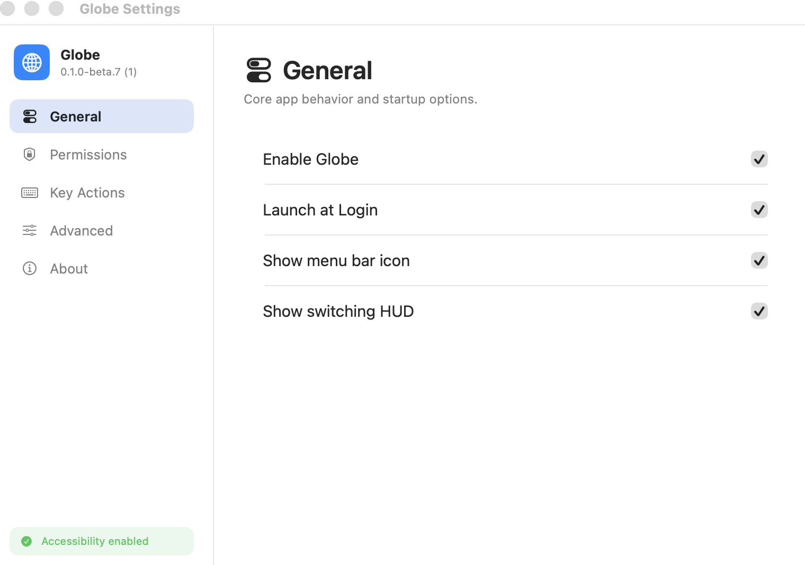
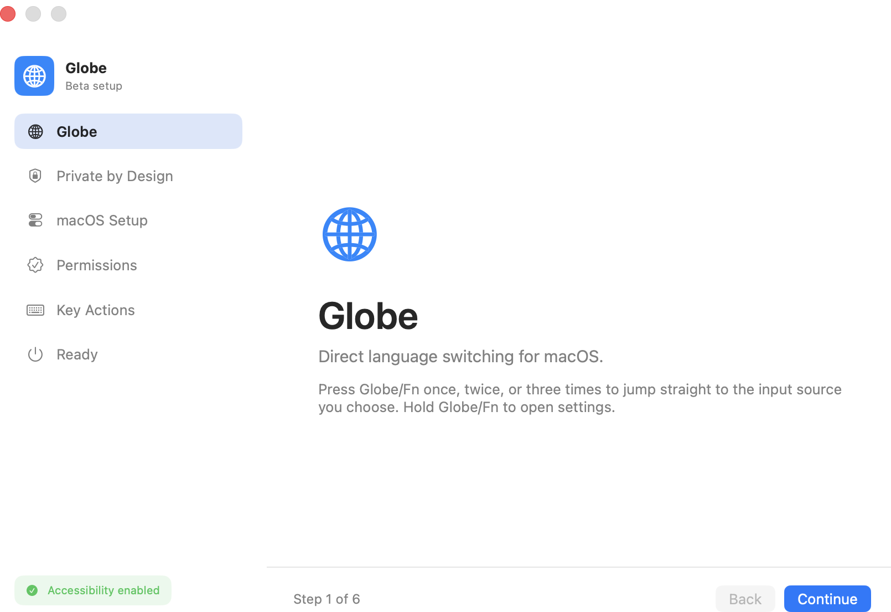
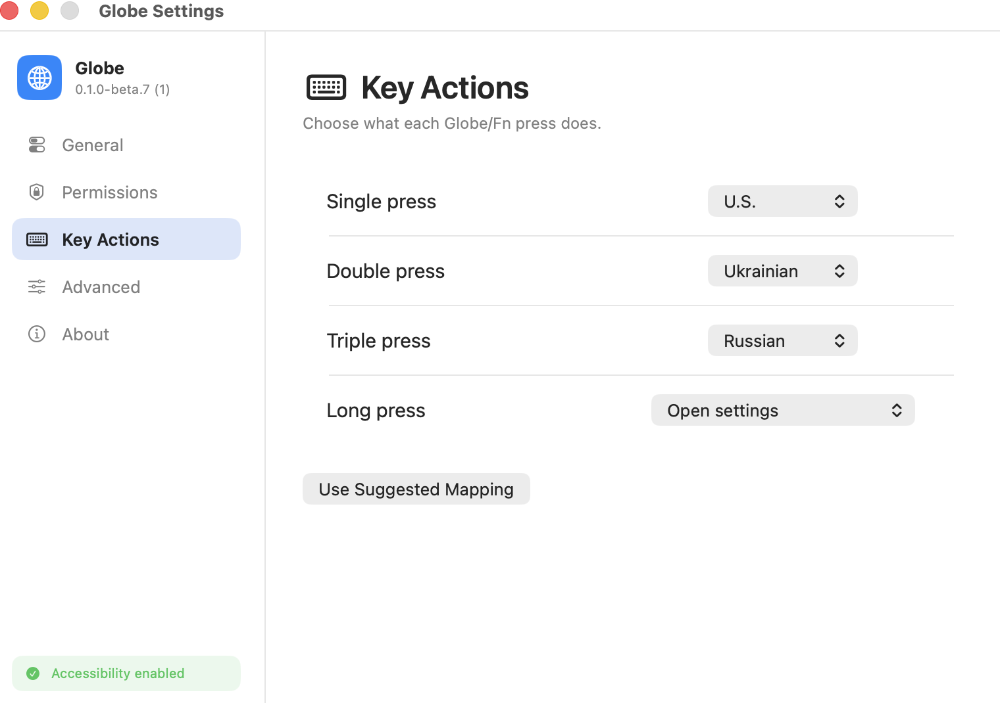
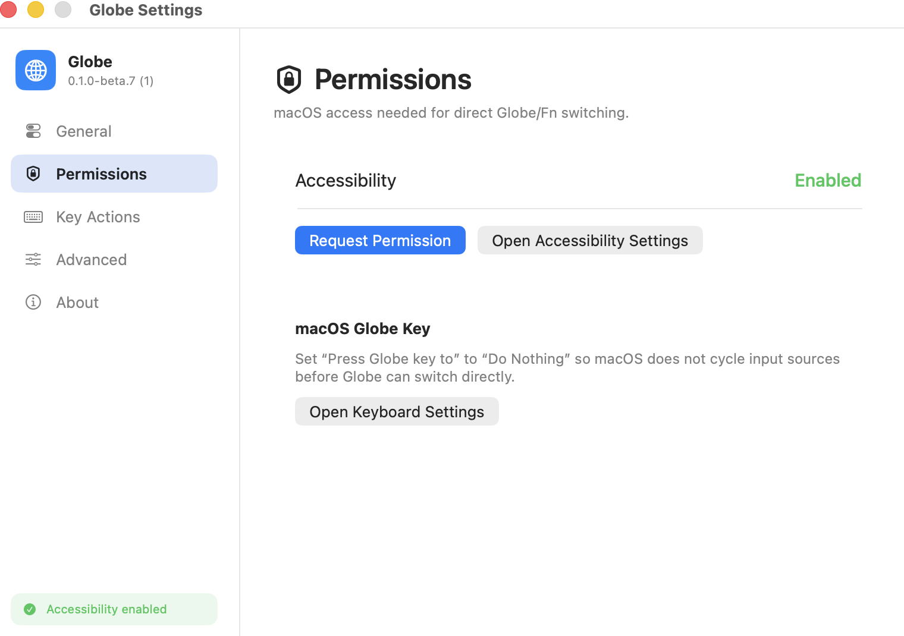

# Globe

Open-source macOS utility for predictable Globe/Fn input source switching.

Globe is a native menu bar app for people who type in multiple languages every day. Instead of cycling through input sources, Globe lets you map direct actions:

- Press Globe/Fn once to switch to one input source.
- Press Globe/Fn twice to switch to another input source.
- Press Globe/Fn three times to switch to a third input source.
- Hold Globe/Fn to open settings.

[Download beta](https://globe.nythral.com) · [Report an issue](https://github.com/NythralHome/globe/issues/new/choose) · [Project site](https://globe.nythral.com) · [Nythral](https://nythral.com)

## Screenshots

<p>
  
  
</p>
<p>
  
  
</p>

## Status

Globe is in public beta for macOS 14 or newer. The installer is signed with Developer ID, notarized by Apple, and distributed through GitHub Releases.

Current beta capabilities:

- Native macOS menu bar app.
- Signed PKG installer that launches Globe after installation.
- Guided first-run setup.
- Launch at login.
- Accessibility permission helper.
- Single, double, triple, and long Globe/Fn press actions.
- Optional switching HUD.
- Manual GitHub release update checks.
- Direct update installer download.
- Exportable diagnostics for bug reports.

## Install

1. Download the latest beta from [globe.nythral.com](https://globe.nythral.com).
2. Open the signed `Globe-*.pkg` installer.
3. Complete the welcome setup.
4. Add Globe to Accessibility when macOS asks for permission.
5. Set `Press Globe key to` to `Do Nothing` in System Settings > Keyboard.

macOS requires the Accessibility and Keyboard steps. Globe does not use private Apple APIs to change those settings silently.

## Updates

Use `Check for Updates` from the Globe menu bar item or the About tab in Settings. When a newer beta exists, Globe downloads the signed PKG installer from GitHub Releases and opens it. After installation, the installer restarts Globe from `/Applications`.

## Privacy

Globe does not record, store, or transmit typed text.

The app only observes Globe/Fn key state changes and macOS input source metadata needed to switch input sources. Diagnostic logs include setup state, permission state, input source names/IDs, and Globe/Fn key events. They do not include typed text.

## Diagnostics

When reporting a bug, use `Export Diagnostics` from the Globe menu bar item or Settings > About. The exported text file includes:

- Globe version.
- macOS version.
- Accessibility status.
- Current input source.
- Installed input sources.
- Globe settings and key mapping.
- Recent Globe log lines.

Diagnostic logs are also written locally to:

```text
~/Library/Logs/Globe/Globe.log
```

## Troubleshooting

### Globe key does nothing

- Confirm Globe is running in the menu bar.
- Open Settings > Permissions.
- Confirm Accessibility is enabled.
- Use `Test Globe key` to verify Globe can observe Globe/Fn.
- Confirm System Settings > Keyboard > `Press Globe key to` is set to `Do Nothing`.

### Globe does not appear in Accessibility

- Install Globe into `/Applications`.
- Open System Settings > Privacy & Security > Accessibility.
- Use the `+` button and select `/Applications/Globe.app`.
- Relaunch Globe.

### macOS says the app cannot be verified

Download the latest PKG from [globe.nythral.com](https://globe.nythral.com). Current beta packages are signed with Developer ID Installer, notarized, and stapled.

## Development

Requirements:

- macOS 14 or newer.
- Xcode command line tools.
- Swift 6 or newer.

Run tests:

```sh
cd app
swift test
```

Build a local app bundle:

```sh
app/Scripts/build-app-bundle.sh
open app/.build/bundles/Globe.app
```

Build a signed PKG when Developer ID identities are installed locally:

```sh
GLOBE_VERSION=0.1.0-beta.18 \
GLOBE_CODESIGN_IDENTITY="Developer ID Application: Your Name (TEAMID)" \
GLOBE_INSTALLER_SIGN_IDENTITY="Developer ID Installer: Your Name (TEAMID)" \
app/Scripts/package-pkg.sh
```

## Repository Layout

- `app/` - native macOS Swift app and core tests.
- `docs/` - beta setup and release notes.
- `.github/` - CI, issue templates, and PR template.

## Contributing

Issues and pull requests are welcome. For behavior bugs, include exported diagnostics when possible. See [CONTRIBUTING.md](CONTRIBUTING.md).

## License

MIT. See [LICENSE](LICENSE).
